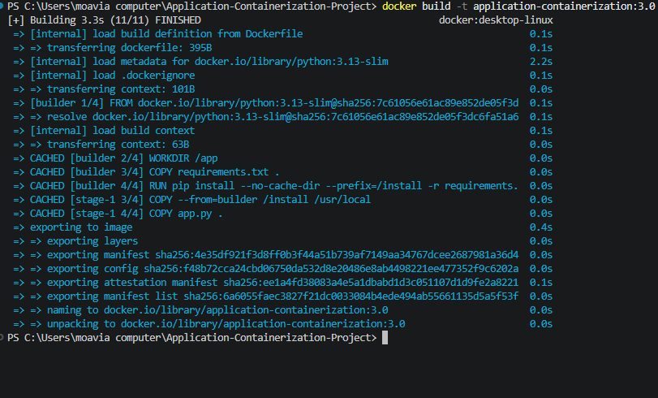
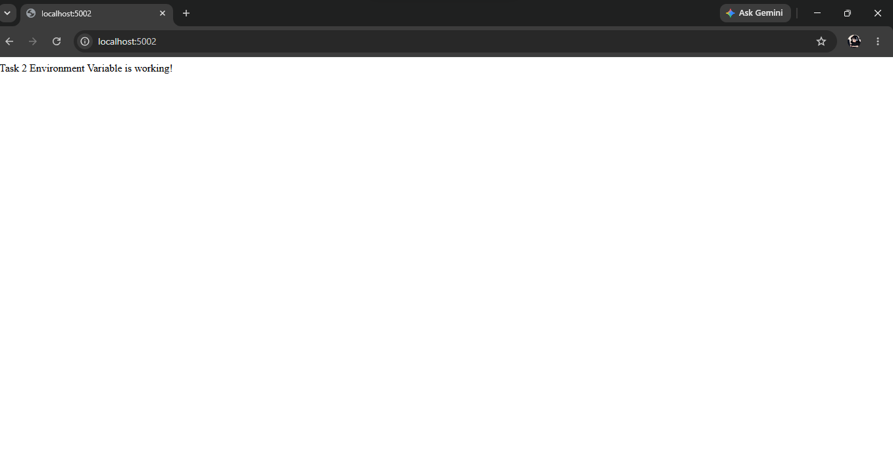
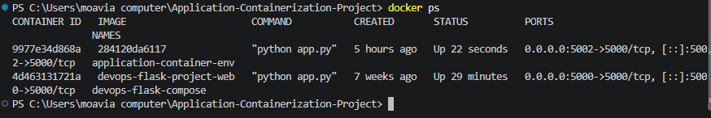
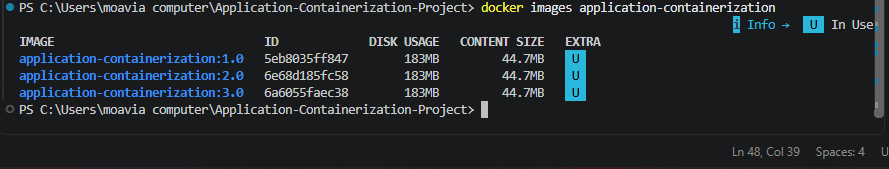

# Progree DevOps Internship – Task 2 Report

## Task Title

Application Containerization & Asset Optimization

## Objective

To build a modular and reliable application container environment using Docker, including a multi-stage Dockerfile, runtime environment configuration, and functional container port routing.

## Technologies Used

1. Python
2. Flask
3. Docker

## Implementation

The Flask application was containerized using a multi-stage Dockerfile.

The project includes runtime environment variable configuration using `APP_MESSAGE` and functional Docker port mapping.

## Task 2 Requirements

1. Multi-stage Dockerfile
2. Image optimization
3. Environment variable configuration
4. Functional container port routing

## Evidence & Verification

### 1. Docker Image Build

The Docker image was successfully built using the multi-stage Dockerfile.

### 2. Environment Variable Test

The `APP_MESSAGE` environment variable was successfully passed to the container and displayed by the application.

### 3. Port Mapping Test

The container was successfully mapped from host port `5002` to container port `5000`.

### 4. Docker Container Verification

The running container was verified using `docker ps`.

### 5. Image Optimization Verification

Docker image layers and image size were inspected using Docker commands.
